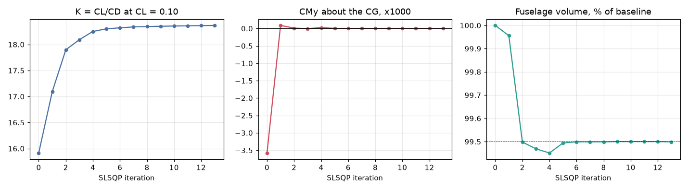
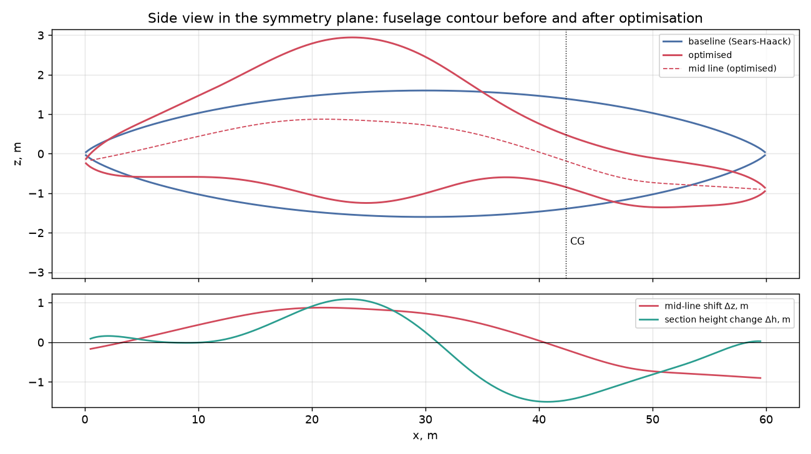
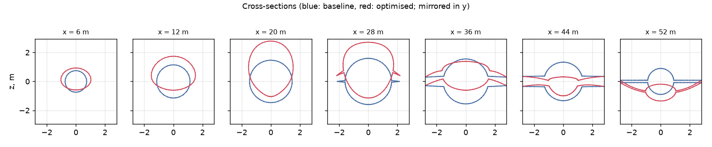
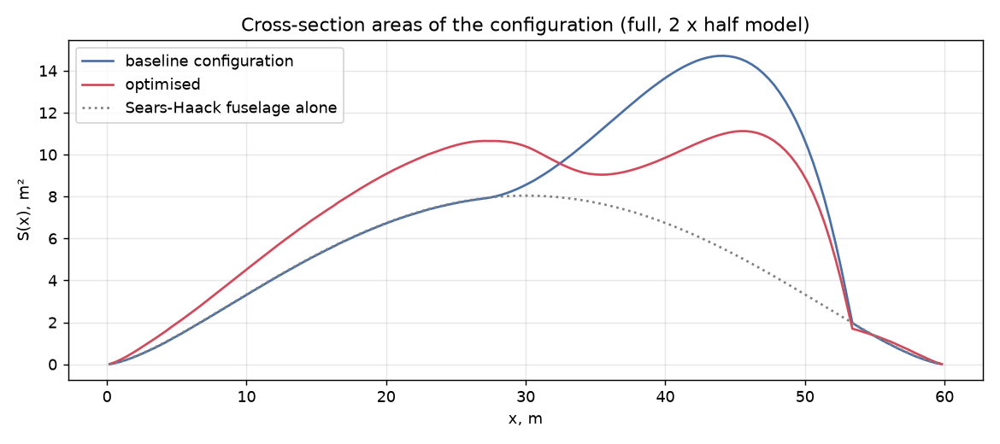
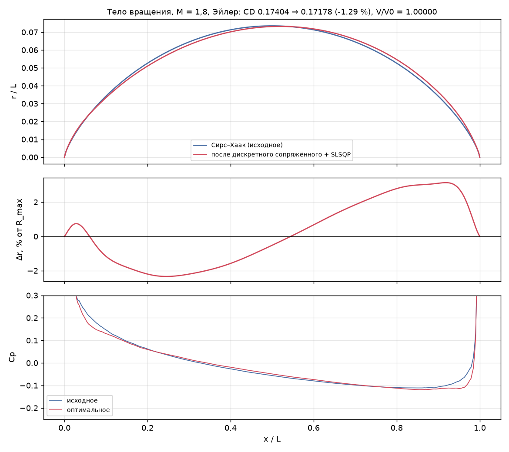
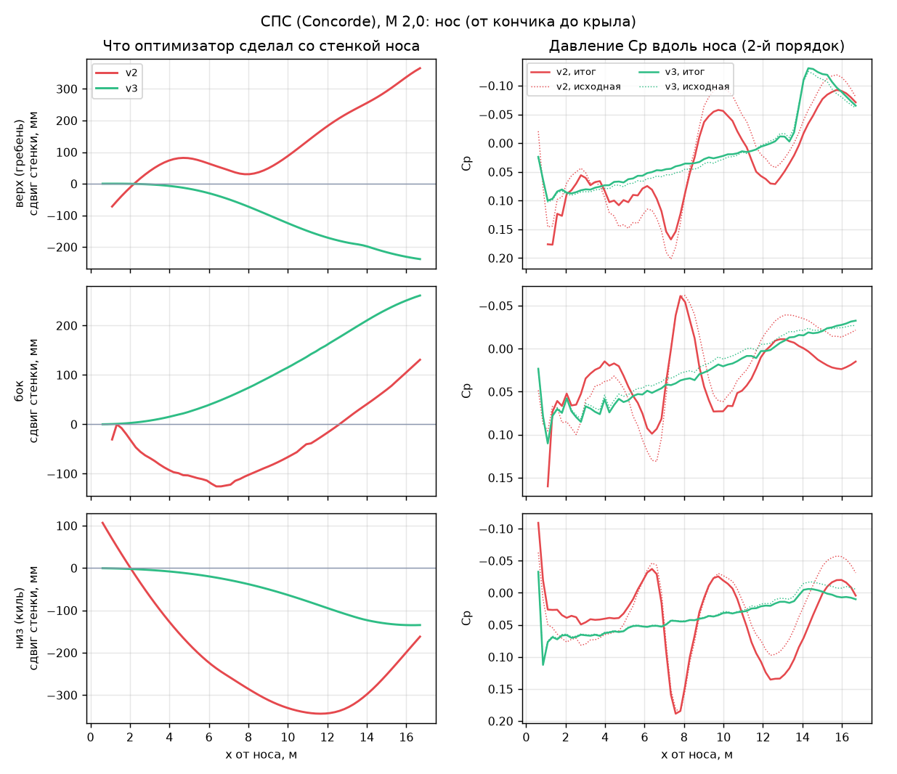
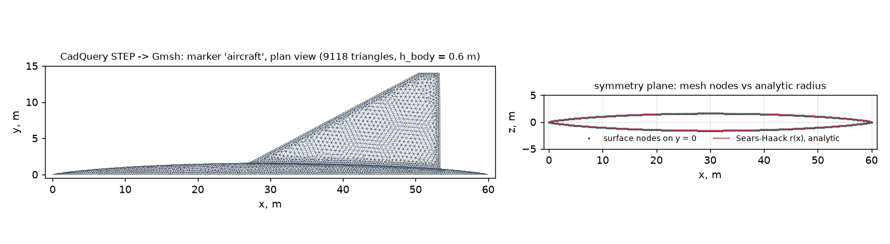

# Trimmed shape optimization with the SU2 discrete adjoint

A Python driver around [SU2](https://su2code.github.io) 8.5.0 that maximizes the lift-to-drag ratio of an
aircraft shape **at fixed lift and zero pitching moment** (trimmed flight):

* **fixed lift:** every flow solution uses SU2's fixed-CL mode, and the gradients are taken at constant CL;
* **trim:** the pitching moment about the centre of gravity is an equality constraint, `CMy = 0`, with its own
  discrete-adjoint gradient;
* **volume:** fuselage volume `V >= 0.995 V0`; the driver computes the volume and its analytic gradient from the
  surface mesh;
* **length:** fixed (FFD control points move only in y and z).

Shape parameterization: FFD (free-form deformation). Gradients: SU2 discrete adjoint (algorithmic
differentiation), checked against finite differences. Optimizers: SciPy SLSQP, a small trust-region SQP
(`scripts/trsqp.py`) and, through an analysis driver, [DAKOTA](https://dakota.sandia.gov)
(`scripts/dakota_driver.py`). Baseline geometry: built in Gmsh (`scripts/make_mesh.py`) or parametrically with
CadQuery → STEP → Gmsh (`scripts/geometry_cadquery.py`).

**Main result** (supersonic wing-body, M = 1.7, Euler, CL = 0.10, 450 design variables):
L/D goes from **15.91** (baseline, not trimmed) to **21.49** trimmed (**+35 %**), `CMy = -3·10⁻⁷`,
fuselage volume 99.50 %. On a 2.8× finer mesh the gain is +30.9 %. The run was stopped by its time budget; the
final KKT (first-order optimality) residual is 4.1 %, so the result is an improved design, **not a converged
optimum**.

**v0.3:** a `robust` preset (1st-order scheme for the optimisation, low-order FFD, nose clamped to 0th and 1st order,
Sobolev metric in the optimizer) removes the surface waves and nose bumps of v0.2; the result is checked with the
2nd-order scheme (`verify`). One command per run: `python run.py --preset robust|verify`.

## Contents

- [Problem](#problem) · [Results](#results) · [Requirements](#requirements) · [Installation](#installation)
- [Quick start: axisymmetric benchmark](#quick-start-axisymmetric-benchmark-about-10-minutes) ·
  [Wing-body case](#wing-body-case) · [Robust preset](#robust-preset-v03-no-waves-no-bumps-on-the-nose) · [Optimizers](#optimizers) · [Geometry](#geometry)
- [Verification status](#verification-status) · [Tests](#tests) · [Repository layout](#repository-layout)
- [Practical notes](#practical-notes) · [Limitations](#limitations) · [Citing](#citing)

## Problem

Design variables `p` are FFD control-point displacements. With the target lift coefficient `CL*` and the centre
of gravity `x_cg`:

```
maximize    K(p) = CL / CD
subject to  CL(p, alpha) = CL*          (alpha is found by SU2 in fixed-CL mode)
            CMy(p; x_cg)  = 0           (trim, equality constraint)
            V(p)         >= 0.995 V0    (fuselage volume)
            L(p)          = L0          (by construction: no x-displacements)
            |p_i| <= b_i                (deformation bounds)
            |second differences of the displacements| <= s   (smoothness, B-spline box only; linear)
```

Because CL is fixed, maximizing K is the same as minimizing CD, so the driver minimizes CD.

**Gradients at constant lift.** With the angle of attack as a dependent variable, the total derivative is

```
dJ/dp |_(CL = CL*) = dJ/dp - (dJ/dCL) * dCL/dp,     J = CD or CMy
```

The SU2 discrete adjoint (`SU2_CFD_AD`) computes exactly this when it runs in fixed-CL mode: it differentiates
`J - (dJ/dCL) CL`, with `dJ/dCL` taken from `DCD_DCL_VALUE` / `DCMY_DCL_VALUE`. The driver computes these two
numbers with one extra flow solution at `alpha + 0.1°` (restarted from the converged solution) and passes them to
the adjoint with `DISCARD_INFILES= YES`. SU2's built-in estimate (`EVAL_DOF_DCX= YES`) is available with
`--dcx su2`, but after a restart it is sometimes not written to `flow.meta`, and a stale value then goes into
the gradient (seen here as `dCMy/dCL` jumping from −0.04 to +0.85; reported as
[su2code/SU2#2937](https://github.com/su2code/SU2/issues/2937)).

One gradient therefore costs one direct run, one run at `alpha + 0.1°`, two adjoint runs (CD and CMy) and two
`SU2_DOT_AD` projections onto the FFD variables. The cost does not depend on the number of design variables.

**Volume.** The half-model volume is a surface integral over the body, `V = ∮ y n_y dA` (the symmetry plane
y = 0 contributes nothing). The driver evaluates it on the deformed surface mesh with its own Python
implementation of the SU2 FFD map (Bernstein or uniform B-spline blending; matches `SU2_DEF` to about 1e-10 m).
The volume gradient is analytic: node derivatives of the integral, then the chain rule through the FFD basis.
Gmsh does not orient surface triangles consistently, so the driver orients each one by its owner tetrahedron.

**Trust-region SQP.** With 450 variables, SLSQP's line search stalled and its first step after a restart was
too large. `trsqp.py` solves a quadratic model with the linearized constraints and an ∞-norm trust region, accepts
steps on the merit function `1e4 CD + 20 |1e3 CMy| + 20 max(0, -c_V)`, and updates a damped BFGS Hessian of the
Lagrangian. The Lagrange multipliers come from sign-constrained least squares on the KKT conditions. Their
residual is reported at every step and is used as a stopping criterion.

## Results

**Wing-body, M = 1.7, Euler, fixed CL = 0.10.** Sears-Haack fuselage L = 60 m, D = 3.2 m; thin near-delta wing
with 62° leading-edge sweep (not optimized); half model, 347k tetrahedra; centre of gravity at 42.35 m, 4 % MAC
(mean aerodynamic chord) ahead of the neutral point, so the baseline is statically stable and not trimmed.

| | baseline | run 1: 66 variables | **run 2: 450 variables** |
|---|---|---|---|
| FFD box | | 11 × 3 × 2 Bernstein | 15 × 5 × 5 cubic B-spline, smoothness constraints |
| K = CL/CD | 15.91 (not trimmed) | 18.37 (+15.4 %) | **21.49 (+35.0 %)** |
| CD, counts (1e-4) | 62.8 | 54.5 | **46.5 (−25.9 %)** |
| CMy about the CG | −3.6·10⁻³ | −1·10⁻⁶ | **−3·10⁻⁷** |
| fuselage volume | 100 % | 99.50 % | 99.50 % (active) |
| angle of attack | 2.66° | 2.13° | 1.50° |
| finer mesh (0.8M / 0.96M tetrahedra) | | +14.1 % | +30.9 % (K 14.92 → 19.53) |
| optimizer | | 13 SLSQP iterations | 10 SLSQP + 18 trust-region SQP iterations |
| KKT residual at the end | | | 4.1 % (75 % at the start of TR-SQP) |

Trim comes from the fuselage itself, without a control surface: the camber of its mid line produces the nose-up
moment that balances the stability margin. The optimizer also removes the cross-section-area bump over the wing
(area rule) and moves volume forward.

Run 2 took 50 flow solutions (6.6 hours on 10 cores of an Apple M5 laptop) and was stopped by its time budget.
At the final design, 252 smoothness constraints, one bound and the volume constraint are active. The KKT residual
of 4.1 % means the design is close to, but not at, a stationary point.

**Gradient checks** (central differences, every point a fixed-CL solution):

* baseline, step 0.1 m: adjoint `dCD/dp` agrees with finite differences to 0.02 % and 0.009 % on two variables,
  `dCMy/dp` to 0.001 %; the analytic volume gradient agrees to 1e-13;
* final design of run 2, step 0.05 m: `dCMy/dp` 0.05 % and 0.67 %, `dCD/dp` 0.51 % and 3.8 %.

In run 2, the SLSQP phase (designs 0–29) still used SU2's `EVAL_DOF_DCX` estimate of `dJ/dCL` (see above). The
trust-region phase recomputed the gradient at its start point and used the separate `alpha + 0.1°` run from then
on. A rerun with the current code will therefore follow a different path.





*Side view in the symmetry plane: baseline (blue), optimized (red), mid line (dashed). Bottom: mid-line shift and
section-height change.*





**Axisymmetric Sears-Haack body, M = 1.8, Euler** (L = 1, V = 0.01 L³, 24.8k triangles, 25 FFD variables,
volume ≥ baseline): CD **−1.29 %** at V/V0 = 1.00000 after 30 SLSQP iterations (82 solver calls, 10 minutes on
6 cores). The adjoint gradient agrees with central finite differences to a relative error of 1.5·10⁻⁵. Volume
moves from the nose to the aft body. In linear theory the Sears-Haack body is already optimal, so the Euler
optimizer can only exploit the nonlinear effects, and the gain is small.



## Requirements

| component | version used | notes |
|---|---|---|
| SU2 | 8.5.0 | built with `-Denable-autodiff=true` (`SU2_CFD_AD`, `SU2_DOT_AD`) and MPI |
| Python | 3.12 | NumPy 2.5, SciPy 1.18 (SLSQP, `lsq_linear`), Matplotlib 3.11 |
| Gmsh | 4.15 with the Python API (conda-forge `gmsh`, `python-gmsh`) | mesh generation (OpenCASCADE kernel) |
| MPI | Open MPI 5.0 | optional; `SU2_NP=1` runs serially |
| VTK | optional | only for the Mach-number plot in `post.py` |
| DAKOTA | 6.24 (public CLI build) | optional; external optimizer through `scripts/dakota_driver.py` |
| CadQuery | 2.8.0 | optional; parametric CAD route `scripts/geometry_cadquery.py` (`pip install cadquery`) |

Tested on macOS (Apple silicon, arm64). The scripts contain nothing platform-specific; Linux should work with the
same environment.

## Installation

conda-forge has no SU2 package for macOS arm64, so SU2 is built from source (about 20 minutes):

```bash
mamba env create -f environment.yml          # Python, gmsh, SciPy + compilers, meson, ninja, Open MPI
conda activate su2

git clone --depth 1 --branch v8.5.0 https://github.com/su2code/SU2.git
cd SU2
export CC=mpicc CXX=mpicxx
./meson.py build -Denable-autodiff=true -Dwith-mpi=enabled -Denable-pywrapper=false \
    --prefix=$HOME/su2 --buildtype=release
./ninja -C build install

export SU2_RUN=$HOME/su2/bin                 # the driver looks for the binaries here, then in PATH
```

If SU2 with AD is already installed, the Python side alone is `pip install -r requirements.txt`.

Environment variables used by the scripts: `SU2_RUN` (SU2 bin directory), `SU2_NP` (MPI ranks, default 4;
`1` runs without MPI), `MPIRUN` (launcher, default `mpirun`).

## Quick start: axisymmetric benchmark (about 10 minutes)

From the repository root:

```bash
SU2_NP=4 python scripts/bench_axi.py --workdir runs/axi --maxiter 30
python scripts/bench_post.py --workdir runs/axi --out runs/axi/figures
```

The script generates the mesh with Gmsh, embeds the FFD box (`SU2_DEF`), solves the baseline and its adjoint,
checks the gradient by finite differences on two variables and runs SLSQP. Smoke test, about 4 minutes on
2 cores: `SU2_NP=2 python scripts/bench_axi.py --workdir runs/axi_smoke --maxiter 2` (from a clean clone: CD
−0.61 % after 2 iterations; adjoint and finite differences agree to 1.4·10⁻⁵).

Output in `runs/axi/`: `history_opt.csv` (CD, V/V0 per solver call), `result.json` (CD before/after, gradient
check, iterations, time), `x_opt.txt` (optimal FFD displacements), and one folder `e_NNN/` per design with the SU2
configs, logs, surface CSV and ParaView files.

## Wing-body case

Shortest route (v0.3): `python run.py --preset robust` then `python run.py --preset verify` (see
[Robust preset](#robust-preset-v03-no-waves-no-bumps-on-the-nose)). The v0.2 commands below still work.

Run 2 (B-spline box, 450 variables): SLSQP first, then the trust-region SQP from the last SLSQP iterate.

```bash
python scripts/make_mesh.py mesh/wing_body.su2 0.25      # ~350k tetrahedra, ~1 minute (0.6 -> ~90k, quick test)
SU2_NP=10 python scripts/driver.py --mesh mesh/wing_body.su2 --workdir runs/wb2 --ffd bspline --maxiter 10
SU2_NP=10 python scripts/trsqp.py --workdir runs/wb2 --maxiter 60 --budget-hours 6
SU2_NP=10 python scripts/fd_check.py --workdir runs/wb2 --eval <N> --h 0.05   # adjoint vs finite differences
python scripts/kkt.py --workdir runs/wb2                                       # KKT residual per iteration
python scripts/post.py --workdir runs/wb2 --out runs/wb2/figures               # PNG figures
```

Run 1 (Bernstein box, 66 variables): `driver.py --ffd bezier --maxiter 15` and no `trsqp.py`.

Options of `driver.py`: `--target-cl` (0.10), `--xcg` (42.35 m), `--vol-frac` (0.995), `--ffd bezier|bspline`,
`--bnd-z`, `--bnd-y`, `--maxiter`, `--budget-hours`, `--stop-dk` (stop when K changes by less than this fraction
on three accepted iterations with all constraints satisfied), `--dcx alpha|su2` (how `dJ/dCL` is computed),
`--template` (another SU2 config template). Options of `trsqp.py`: `--start-eval` (default: the final design of
`driver.py`), `--maxiter`, `--delta0` (initial trust radius, 0.15 m), `--nu` (merit penalty, 20), `--budget-hours`,
`--stop-dk`, `--kkt-tol` (0.01).

* `--ffd bezier`: 11 × 3 × 2 Bernstein control points, 66 variables (z-displacements of the layers j = 0, 1 and
  y-displacements of j = 1), bounds |Δz| ≤ 1 m, |Δy| ≤ 0.5 m.
* `--ffd bspline`: 15 × 5 × 5 cubic B-spline control points; the z-displacements of j = 0 and j = 1 are linked
  (smooth crest and keel in the symmetry plane); 450 variables mapped to 525 SU2 design variables; bounds
  |Δz| ≤ 1.5 m, |Δy| ≤ 0.8 m; 1110 linear smoothness constraints on second differences of the displacement field
  (0.40 m along x, 0.25 m along y and z).

In both cases the outer FFD layer is frozen: the wing panel outside the box does not move, and the wing root
inside the box deforms with the fuselage.

Output in the workdir: `dsn_history.csv` (CD, CL, CMy, AoA, K, V/V0 per design), `opt_iterations.txt` (accepted
iterations of both optimizers), `opt_result.json` and `trsqp_result.json` (summaries), `trsqp_log.csv` (every
trust-region step), `timing.csv` (every SU2 call), `kkt.json`, and one folder per design `dsn_NNN/` with `p.txt`,
`x.txt`, the SU2 configs and logs, `history*.csv`, `flow.meta`, `dcx.json` (dCD/dCL, dCMy/dCL), the surface CSV,
`flow.vtu` and the gradients `grad_CD.txt`, `grad_CMy.txt` (optimizer variables) and `gradx_*.txt` (SU2
variables).

## Robust preset (v0.3): no waves, no bumps on the nose

**Symptom.** After the v0.2 runs the fuselage wall had waves (a period of about two FFD control planes) and bumps
near the nose, and the pressure along the body followed them.

**Cause** (measured with `scripts/smoothness.py` and the final control net of run 2):

| measure on run 2 (v0.2, 450 variables) | value |
|---|---|
| sign changes of the second difference along an average control line of the box | 5.2 of 12 possible (a zig-zag) |
| largest displacement of the two nose control planes | 0.82 m |
| new extrema of the wall displacement in the nose zone (x 0.6 … 23.4 m) | 10 |
| bumps / dents of the nose radius (prominence > 12 mm) | 0 before → 2 after, up to 139 mm |

The nose planes carry the largest pressure gradients and were free, so the optimizer pushed them furthest. The
first trust-region steps use an identity Hessian, so they follow the raw adjoint gradient, which alternates from
plane to plane; the second-difference limits (0.40 m) were too loose to stop that.

**Fix.** `python run.py --preset robust` (optimisation) and `python run.py --preset verify` (check):

* *1st-order scheme for the optimisation:* Roe without MUSCL (`MUSCL_FLOW= NO`, piecewise-constant reconstruction
  of the state, i.e. a 0th-order reconstruction and a 1st-order scheme). Monotone at shocks, no limiter switching:
  the discrete-adjoint gradient is a smooth function of the shape, and the solver needs fewer iterations.
  The 2nd-order scheme (JST, as in v0.2) is used only by `verify`, which recomputes the baseline and the final
  design at the same CL.
* *Low-order shape:* `--ffd bspline_low`, 9 × 5 × 5 control points instead of 15 × 5 × 5 (cubic B-splines kept, so
  the surface stays C2 — a piecewise-linear FFD would add kinks, i.e. shocks); 180 variables instead of 450.
* *Nose clamped to 0th and 1st order* (planes i = 0 and i = 1 carry no variables: the tip position and the tip
  slope stay as built), *tail to 0th order* (i = 8).
* *Sobolev metric* `M = I + 2 Dx'Dx + 0.5 (Dy'Dy + Dz'Dz)` (D: second differences of the control net) as the initial
  Hessian of `trsqp.py`: a zig-zag costs about 20 times more than a smooth bend, so the steps are smooth from the
  first iteration. This preconditions the step, it does not change the gradient, so the KKT test stays exact.
  (SU2's own `SMOOTH_GRADIENT` smooths the mesh sensitivity instead, which changes the gradient the optimizer
  sees; the parameter-space metric was enough here.)

**Check on the wing-body case** (coarse mesh h = 0.6 m, 93k tetrahedra, 8 trust-region iterations each, 4 MPI
ranks; L/D at CL = 0.10 and CMy = 0, Euler):

| | v02 preset (JST, 15 × 5 × 5, free nose) | robust preset (1st order, 9 × 5 × 5, clamped nose, Sobolev) |
|---|---|---|
| L/D, scheme of the optimisation | 19.65 → 26.77 (+36 %) | 19.04 → 20.27 (+6.5 %) |
| L/D, recomputed with JST (`verify`) | same as above | 19.65 → 21.27 (+8.3 %) |
| bumps / dents of the nose radius after optimisation | 3 (up to 15 mm) | 0 |
| largest wall displacement in the nose zone | 0.88 m | 0.24 m |
| largest curvature added to the nose profile | 0.073 1/m | 0.041 1/m |
| wall time | 16 min | 4 min + 2 min check |

The robust preset trades L/D for shape quality: in the same number of iterations it gains much less, because the
nose — where the v02 run found most of its drag reduction, by reshaping it far from the original — is clamped, and
the metric damps large local steps. On this coarse mesh the wave count of the displacement (`d_ext`) is dominated
by facet noise of the plane cuts on the side rays and is not meaningful; use it with surface cells of 0.25 m or
less.

Three further aircraft models built from open data (Concorde, MiG-29, Su-57; multi-box FFD, flow-through
engines; not in this repository) were rerun with the same preset: the waves of the wall displacement and the nose
bumps disappeared, the pressure along the nose became monotone, and the adjoint-vs-finite-difference error of
dCMy fell from 24 % to 0.01 % (Concorde).  On those models, with the second-order check, L/D grew by 21 % (Concorde),
12 % (MiG-29) and 23 % (Su-57) in 1–1.75 h on 4 cores, against 34 %, 25 % and 32 % of the free v0.2 runs in 3–6 h on 8
cores with the wavy shapes.




## Optimizers

The problem (objective, constraints, gradients, design cache) is defined once in `scripts/driver.py` (`Problem`,
`Evaluator`); three optimizers use it.

* **SciPy SLSQP** (`driver.py`): sequential quadratic programming on the scaled problem (CD in drag counts,
  CMy in 1e-3). Used for run 1 and for the first 10 iterations of run 2.
* **Trust-region SQP** (`trsqp.py`): quadratic model with linearized constraints, ∞-norm trust region, merit
  function, damped BFGS and a KKT-residual stopping test; written for the 450-variable B-spline case, where
  SLSQP's line search stalled. Used for the last 18 iterations of run 2.
* **DAKOTA** (`dakota_driver.py`, `dakota/`): DAKOTA's standard `fork` interface. DAKOTA writes a parameters
  file (design variables, active-set vector, derivative variables); the driver runs SU2 and writes the
  results file with `-K`, `0.995 - V/V0`, `CMy` and, on request, their gradients (`d(-K)/dp = (CL/CD²) dCD/dp`
  from the fixed-CL adjoint, `dCMy/dp` from the second adjoint, the analytic volume gradient). Both
  parameters-file formats (standard and aprepro) and derivative-variable subsets are supported; Hessian
  requests are rejected. Each evaluation is a new process: the driver reloads the finished designs of the
  workdir, serves repeated requests from that cache and restarts SU2 from the last solution.
  `dakota_driver.py setup` embeds the FFD box and writes the input file: `dakota/trimmed_ld.in` is the one for
  the 66-variable Bernstein box; for the B-spline box the 1110 smoothness rows go in as
  `linear_inequality_constraint_matrix`.

```bash
python scripts/dakota_driver.py setup --mesh mesh/wing_body.su2 --workdir runs/dk --ffd bezier \
    --out dakota/trimmed_ld.in
SU2_NP=8 dakota -i dakota/trimmed_ld.in -o runs/dk/dakota.out
```

Methods of the public DAKOTA build (6.24) that take `analytic_gradients` with the equality and inequality
constraints of this problem: `optpp_q_newton` (quasi-Newton with a nonlinear interior-point treatment of the
constraints; default in `trimmed_ld.in`) and `rol` (augmented Lagrangian). `conmin_mfd` accepts the problem but
stalled on the test problem. `npsol_sqp`, `nlpql_sqp` and `dot_sqp` need commercial libraries that the public
binaries do not contain. The DAKOTA workdir has the layout of a `driver.py` workdir (`dsn_NNN/`,
`dsn_history.csv`, `timing.csv`), so `fd_check.py`, `kkt.py` and `post.py` apply to it. Details, options and
the stub problem for trying an input file without SU2: [`dakota/README.md`](dakota/README.md).

## Geometry

Two routes produce the same kind of tetrahedral mesh (markers `aircraft`, `symmetry`, `farfield`; flow box,
size fields and algorithms are in `make_mesh.mesh_domain`):

* **Gmsh only** (`make_mesh.py`, the published runs): the Sears-Haack body of revolution and the ruled-loft
  wing are built in Gmsh's OpenCASCADE kernel (`make_mesh.build_aircraft`), fused and cut from the flow box.
* **CadQuery → STEP → Gmsh** (`geometry_cadquery.py`): the fuselage is a parametric body of revolution
  `r(x) = R (4ξ(1−ξ))ⁿ`, `ξ = x/L`, defined by its length `L`, its volume `V` (R follows), the exponent `n`
  (0.75 = Sears-Haack) and an optional flat base cut at `x = xb L`; the wing is the same as above. CadQuery
  writes a STEP file (`cad/aircraft_baseline.step`, 84 kB, is the baseline), Gmsh imports it and calls the same
  `mesh_domain`. With the defaults the two routes differ only by the CAD tessellation: 97k against 93k
  tetrahedra at h = 0.6 m, half-body volume from the surface mesh 208.4 against 207.8 m³.

```bash
pip install cadquery          # a separate venv is recommended (pulls in OCP, about 400 MB); or conda-forge cadquery
python scripts/geometry_cadquery.py --step mesh/aircraft.step --mesh mesh/wing_body_cq.su2 --h-body 0.25
python scripts/geometry_cadquery.py --step mesh/body.step --exponent 0.6 --base 0.95 --no-wing    # other bodies
```

This closes the loop CAD parameters → mesh → SU2 → discrete adjoint → optimizer: the CAD parameters (L, V, n,
xb) define the baseline, the FFD variables deform it inside the optimization, and a new baseline costs one
mesh. A CAD detail worth knowing: a single 360° face of revolution is periodic, and after the union with the
wing its trimming is lost in the STEP export (only the patch inside the wing-body intersection survives), so
the fuselage is built from two 180° revolutions with the seam plane at 45° to the wing and symmetry planes.



## Verification status

| item | status |
|---|---|
| adjoint gradients dCD/dp, dCMy/dp vs central finite differences | verified (0.02 % / 0.001 % at the baseline, 0.5–3.8 % at the final design of run 2, see Results; on the coarse DAKOTA-check mesh, `fd_check.py --h 0.1` at the baseline: dCD/dp 0.9 %, dCMy/dp 0.002 %, volume 3e-12) |
| analytic volume gradient | verified to 1e-13 |
| runs 1 and 2 (SLSQP, TR-SQP) | published above; run 2 is not converged to a KKT point (4.1 % residual) |
| DAKOTA driver: parameters-file formats, ASV / DVV handling, gradient assembly | unit tests, no SU2 (`tests/test_dakota_driver.py`) |
| DAKOTA 6.24 `optpp_q_newton` on the analytic stub problem | verified: same optimum as SciPy SLSQP (variables within 2e-3) |
| DAKOTA 6.24 `rol` on the stub | verified: same optimum (within 3e-7), but 1524 evaluations |
| DAKOTA 6.24 `conmin_mfd` on the stub | runs, stops after 9 evaluations 9 % above the optimum; not recommended |
| DAKOTA 6.24 `optpp_q_newton` + SU2 8.5.0, coarse mesh (h = 0.6 m, 93k tetrahedra), 66 variables | two iterations run: 3 SU2 designs with gradients in 100 s on 8 cores; CMy −4.56e-3 → −3.77e-3, V/V0 1.0000 → 1.0003, K 19.61 → 19.58 (the interior-point method restores feasibility first) |
| DAKOTA on the published mesh (h = 0.25 m) or on the 450-variable B-spline case | not run (input generated) |
| CadQuery route: fuselage volume vs analytic, STEP round trip, mesh markers and extent | unit tests with CadQuery 2.8.0 and Gmsh 4.15.2 (`tests/test_geometry_cadquery.py`) |
| CadQuery-route mesh through SU2 (h = 0.6 m, 97k tetrahedra, fixed-CL Euler run through the DAKOTA driver) | run: converges like the Gmsh-only mesh (900 iterations, 30 s on 8 cores); CD 48.9 against 51.0 counts, CMy −5.1e-3 against −4.6e-3, AoA 2.70° against 2.72° — the scatter of two different coarse tessellations, neither is grid-converged (see Limitations) |
| `make_mesh.py` after the split into functions | same mesh as before (93473 tetrahedra with one thread; HXT with several threads is not reproducible run to run) |

## Tests

```bash
python -m unittest discover -s tests -v        # or: pytest tests
```

The tests need no SU2 and run on every push and pull request (GitHub Actions). `tests/test_presets_smoothness.py` checks the scheme written into the SU2 config by each preset, the clamped planes, that the Sobolev metric is symmetric positive definite and turns a zig-zag gradient into a smooth step, and that the smoothness metrics find a 50 mm bump and a wavy wall on synthetic bodies and nothing on a smooth ogive. `tests/test_dakota_driver.py` checks the DAKOTA file formats and the gradients in the
results file against finite differences of the stub problem; with a `dakota` executable on `PATH` (or in
`$DAKOTA_EXE`) it also runs DAKOTA on the stub and compares with SLSQP. `tests/test_geometry_cadquery.py`
skips the CAD parts without CadQuery and the mesh part without Gmsh. The checks that need SU2 are
`scripts/fd_check.py` on a workdir and the axisymmetric smoke test (`bench_axi.py --maxiter 2`).

## Repository layout

| path | content |
|---|---|
| `scripts/driver.py` | problem set-up, evaluator with caching and the dJ/dCL run, SLSQP, stopping rule |
| `run.py` | one command per run: `--preset robust` (optimisation), `verify` (2nd-order check), `v02` |
| `scripts/presets.py` | presets: scheme, FFD, clamped planes, Sobolev metric |
| `scripts/smoothness.py` | waves and nose bumps from SU2 surface output (plane cuts, five rays, Cp extrema) |
| `scripts/trsqp.py` | trust-region SQP on the same problem and evaluator (initial Hessian = `Problem.metric()`) |
| `scripts/su2run.py` | SU2 wrapper: config templates, runs, history and gradient readers, FFD re-implementation, volume and its gradient |
| `scripts/dakota_driver.py` | DAKOTA analysis driver (parameters file → SU2 → results file); `setup` writes the DAKOTA input; `--stub` analytic test problem |
| `scripts/geometry.py`, `scripts/make_mesh.py` | wing-body geometry and FFD boxes; Gmsh geometry (`build_aircraft`) and mesh (`mesh_domain`; markers `aircraft`, `symmetry`, `farfield`) |
| `scripts/geometry_cadquery.py` | parametric fuselage (length, volume, exponent, base cut) and wing in CadQuery → STEP → Gmsh mesh through `mesh_domain` |
| `scripts/fd_check.py`, `scripts/kkt.py`, `scripts/post.py` | gradient check, KKT check, figures |
| `scripts/bench_axi*.py` | axisymmetric Sears-Haack benchmark: mesh, optimization, figures |
| `config/*.cfg` | SU2 config templates with `{PLACEHOLDERS}` |
| `dakota/` | `trimmed_ld.in` (generated DAKOTA input, 66 variables) and `README.md` |
| `cad/aircraft_baseline.step` | baseline wing-body STEP file written by `geometry_cadquery.py` |
| `tests/` | unit tests (presets and metric, smoothness metrics, DAKOTA driver, CadQuery route); no SU2 needed; run by GitHub Actions |
| `figures/` | figures of the published runs and of the CadQuery-route mesh |

Meshes, solutions and restart files are generated by the scripts and are not stored in the repository.

## Practical notes

* Paths inside SU2 config files must not contain spaces, so every run folder uses relative paths and the input
  mesh is copied into `<workdir>/setup/`.
* After `SU2_CFD_AD`, `restart_adj_<obj>.dat` has to be copied to `solution_adj_<obj>.dat` for `SU2_DOT_AD`.
* SLSQP modifies its argument in place; the design cache stores copies.
* Each new design restarts from the previous flow solution and angle of attack.
* When the adjoint restarts from a fixed-CL solution, SU2 reads `DCD_DCL_VALUE` / `DCMY_DCL_VALUE` from the restart
  metadata unless `DISCARD_INFILES= YES` is set, and for a fixed-CL adjoint SU2 resets `DISCARD_INFILES` to `NO`
  unless `EVAL_DOF_DCX= YES` is also set. The driver sets both in the adjoint configs; the log then shows
  "Discarding the dCD/dCL in the direct solution file".

## Limitations

* Inviscid (Euler) flow: no friction and no base drag; absolute K values are inviscid. A RANS run with the discrete
  adjoint is the natural next step (SU2 differentiates the turbulence model as well).
* Only the fuselage is shaped; the wing planform, twist and camber are fixed.
* Run 2 is not converged to a KKT point (4.1 % residual); run 1 ended with 45 of 66 variables on their bounds, so
  its gain was limited by the allowed deformation.
* Cabin-size constraints per station are not included (only the total volume).
* The optimization mesh is not grid-converged in absolute CD (about 6 % between 0.35M and 0.8M cells); the gain
  and the trim carry over to the finer meshes.
* The FFD re-implementation assumes a rectangular, axis-aligned box.

## Related

* SU2: <https://github.com/su2code/SU2>, documentation <https://su2code.github.io>.
* Upstream fixes and reports found while building this:
  [su2code/SU2#2934](https://github.com/su2code/SU2/pull/2934) (SU2_PY station names for `SU2_GEO` constraints),
  [su2code/SU2#2935](https://github.com/su2code/SU2/pull/2935) (quoting the SU2 executable path in SU2_PY),
  [su2code/SU2#2937](https://github.com/su2code/SU2/issues/2937) (dCL derivatives not written to `flow.meta`).
* Earlier work on the same Sears-Haack drag problem at M = 1.8: a combined approach (global IOSO search followed
  by continuous-adjoint SU2 refinement), N. D. Ageev, A. A. Pavlenko, HiSST 2018 (below). The axisymmetric
  benchmark here repeats that problem with the discrete adjoint (Euler only, fixed ends).

## Citing

If this driver is useful, please cite the repository (see `CITATION.cff`) and SU2:

* N. Ageev, *su2-trimmed-shape-optimization: trimmed aerodynamic shape optimization with the SU2 discrete
  adjoint*, version 0.3.0, 2026, <https://github.com/nikita-ageev/su2-trimmed-shape-optimization>.
* T. D. Economon, F. Palacios, S. R. Copeland, T. W. Lukaczyk, J. J. Alonso, *SU2: An Open-Source Suite for
  Multiphysics Simulation and Design*, AIAA Journal 54(3), 828–846, 2016,
  [doi:10.2514/1.J053813](https://doi.org/10.2514/1.J053813).

Related earlier paper by the author:

* N. D. Ageev, A. A. Pavlenko, *Combined approach on the aerodynamic shape optimization*, HiSST 2018:
  International Conference on High-Speed Vehicle Science & Technology, Moscow, 26–29 November 2018,
  [PDF](https://aerospacerepository.org/wp-content/uploads/2023/10/hisst-2018_600969.pdf).

## License

MIT (see `LICENSE`). SU2 itself is not included; it is distributed under LGPL-2.1.

---

## Кратко по-русски

Драйвер оптимизации формы для SU2 8.5.0 с дискретным сопряжённым методом: максимум аэродинамического качества
K = CL/CD при заданной подъёмной силе (режим фиксированного CL) и нулевом моменте тангажа относительно центра масс
(балансировка), объём фюзеляжа не меньше 99,5 %, длина фиксирована. Компоновка «крыло–фюзеляж», M = 1,7, уравнения
Эйлера, 450 параметров FFD (свободной деформации): K 15,91 → 21,49 (+35 %), CMy = −3·10⁻⁷, объём 99,50 %; на мелкой
сетке +30,9 %. Остановлено по бюджету времени, невязка условий оптимальности (ККТ) 4,1 % — улучшенная форма,
а не строгий оптимум. Версия 0.3.0: пресет robust (схема 1-го порядка для оптимизации, FFD низкого порядка, нос закреплён по 0-му и 1-му порядку, метрика Соболева в оптимизаторе) убирает волны поверхности и бугры на носу; итог проверяется схемой 2-го порядка (verify); запуск — `python run.py --preset robust|verify`. Версия 0.2.0: интерфейс к DAKOTA (драйвер анализа с аналитическими градиентами из
сопряжённого решения) и параметрическая геометрия CadQuery → STEP → Gmsh — замкнутый цикл геометрия → сетка →
SU2 → сопряжённый → оптимизатор.
